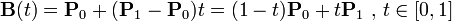
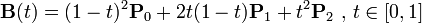

# Bezier(贝塞尔曲线)

### 线性贝塞尔曲线

给定点P0、P1，线性贝塞尔曲线只是一条两点之间的直线。这条线由下式给出：
> 
> 

### 二次方贝塞尔曲线

二次方贝塞尔曲线的路径由给定点P0、P1、P2的函数B（t）追踪：
> 
> 

### 三次方贝塞尔曲线

P0、P1、P2、P3四个点在平面或在三维空间中定义了三次方贝塞尔曲线。曲线起始于P0走向P1，并从P2的方向来到P3。一般不会经过P1或P2；这两个点只是在那里提供方向资讯。P0和P1之间的间距，决定了曲线在转而趋进P3之前，走向P2方向的“长度有多长”。曲线的参数形式为：
> 
> 
